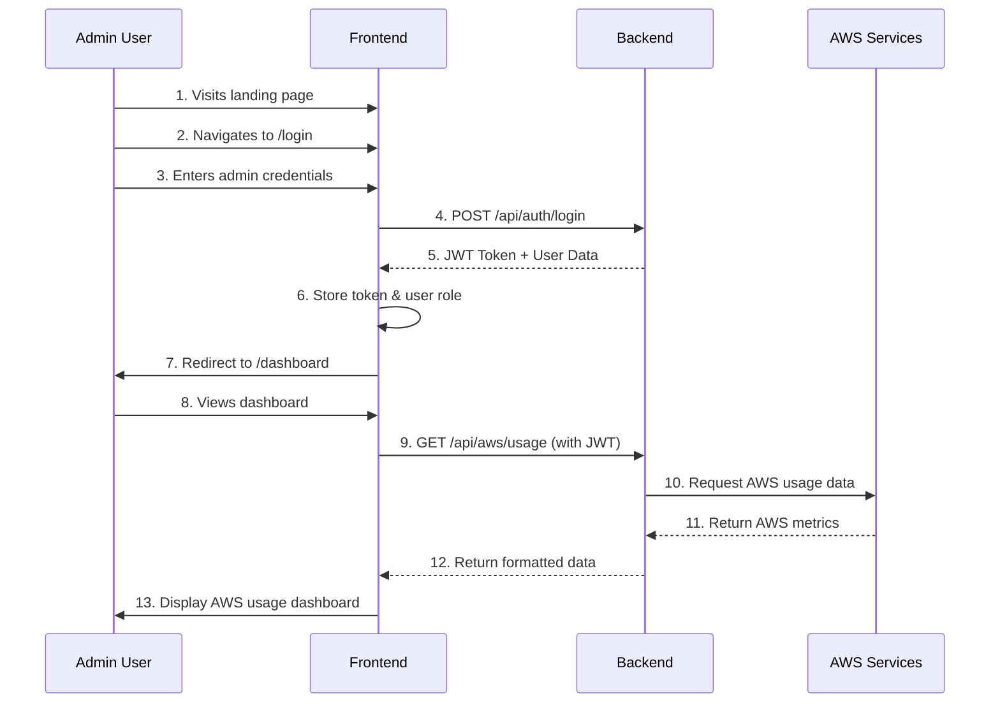
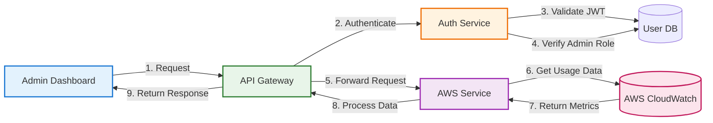

# Admin User Flows

## 1. Authentication & Dashboard Access

## 2. AWS Data Access Flow

### Key Components:

1. **Frontend (React)**
   - Handles user interface and interactions
   - Manages authentication state
   - Displays AWS usage data in dashboard

2. **Backend (Node.js/Express)**
   - Validates JWT tokens
   - Enforces role-based access control
   - Fetches and processes AWS data

3. **AWS Services**
   - CloudWatch for metrics and monitoring
   - IAM for secure access control
   - Other AWS services as needed

### Security Notes:
- All API requests require valid JWT
- Admin role verification on sensitive endpoints
- Rate limiting and request validation
- AWS credentials securely stored and managed
